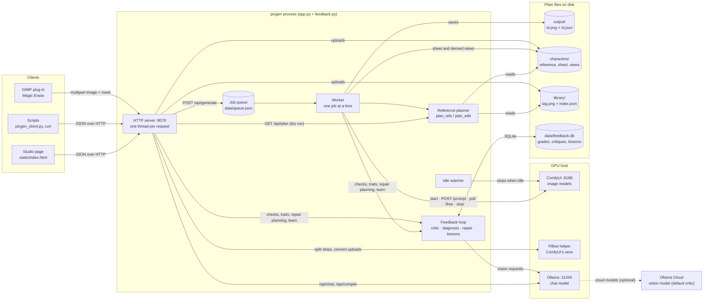
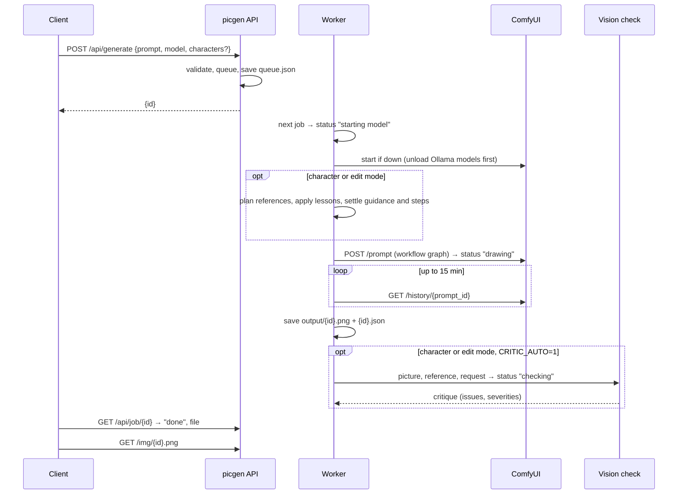

# picgen studio

A private image studio that runs on your own GPU: text to image in seconds, recurring characters that keep their likeness, a reference planner that picks poses, faces and outfits from one sentence, editing, magic erase, and a feedback loop that learns. One web page and one HTTP API, Python standard library only.

| | |
|---|---|
| Studio | `http://127.0.0.1:8070/` (or your proxy address) |
| Documentation | `/docs` on the server, or [docs/](docs/) in this repository |
| API explorer | `/api/docs` (Swagger UI, live **Try it out**) |
| API spec | `/api/openapi.json`, also [docs/openapi.json](docs/openapi.json) (OpenAPI 3.1, 46 operations) |
| API client | [tools/picgen_client.py](tools/picgen_client.py) `--help` |

## What it does

- **Text to image** with seven models and a built-in guide to which suits what: Z-Image Turbo (fast, literal, Apache 2.0), FLUX.1-dev (photoreal), ToonYou (cartoon), and two character and two edit modes (Qwen-Image-Edit 2511, Apache 2.0; FLUX.1 Kontext, non-commercial).
- **Characters.** Save a character from an upload or any picture you made. picgen renders a 13-view sheet (faces, profile, back, full body, sitting) and uses those views as references so the likeness holds across scenes.
- **Reference planner.** Write "runs away scared in a hoodie" and the planner picks a running pose, a scared face and a hoodie from the shared library, shows you the plan before any GPU time is spent, and raises guidance and steps when guides are used.
- **Editing and magic erase.** Change one thing in a picture and keep the rest, or mask an object and have the background filled in. A GIMP 3 plug-in sends the current selection to the erase endpoint.
- **Feedback loop.** Thumbs up or down with issue tags, an automatic vision check, a diagnosis, a one-click repair, and lessons: small rules that adjust future prompts and settings. Repairs that keep working strengthen the rules; the outcome of every fix is recorded.
- **GPU sharing.** ComfyUI starts on the first job, Ollama chat models are unloaded to make room, and the engine stops after a few idle minutes so other software gets the card back.
- **API first.** Everything the studio does is a documented JSON endpoint. The page is one client; `curl`, the Python client and your own scripts are others.

## What it looks like

| Creating a character | Using a character |
|---|---|
|  |  |

A recurring character across scenes and a full restyle, all from one saved reference:

| | | |
|---|---|---|
|  |  |  |
| The reference portrait (FLUX.1-dev) | Same character, new scene (`qwen-image`) | Same picture restyled (`qwen-image-edit`) |

[docs/demo](docs/demo/README.md) has the full set, which model made each picture, and how the fixes and the one-element logo edit were done.

## How it fits together



Drawing never leaves the host. The only step that uses the cloud by default is the vision check that reviews finished pictures, because a vision model large enough to judge pictures does not fit on a 24 GB card beside the image models; set `CRITIC_MODEL` to a local model or `CRITIC_AUTO=0` to keep everything local. [Operations → Privacy](docs/07-operations.md#privacy) lists exactly what is sent.

### Life of a picture



Job statuses: `queued`, `starting model`, `drawing`, `drawing a pose guide`, `checking`, `done`, `failed`. Failed jobs stay readable until the next restart; the queue itself survives restarts.

## Requirements

- Linux host with an NVIDIA GPU (24 GB recommended; [Operations](docs/07-operations.md#requirements) lists what each model needs)
- [ComfyUI](https://github.com/comfyanonymous/ComfyUI) 0.38 or later, in a virtual environment at `COMFY_DIR/venv` with Pillow. The model files are fetched by `tools/install_models.sh` (see Install)
- [Ollama](https://ollama.com) with a chat model, plus a vision model if you want the automatic check to run locally
- Python 3.12 or later. The server has no third-party dependencies; Pillow is used only through ComfyUI's venv.

## Install

```bash
git clone https://github.com/curlyphries/picgen.git ~/picgen
cd ~/picgen
COMFY_DIR=~/ComfyUI tools/install_models.sh              # core set: Z-Image Turbo + Qwen-Image-Edit (43 GB, Apache 2.0)
COMFY_DIR=~/ComfyUI tools/install_models.sh all          # or everything: + FLUX Kontext, FLUX.1-dev, ToonYou (76 GB)
tools/install_library.sh                                 # the garment library: 298 tops, bottoms, hats, shoes, accessories (260 MB)
PICGEN_PORT=8070 COMFY_DIR=~/ComfyUI python3 app.py      # try it in the foreground first
```

The installer downloads from public Hugging Face repositories and Civitai with resumable transfers, skips complete files, and sets up the `ComfyUI-GGUF` node the Qwen models need. [Operations → Downloading the models](docs/07-operations.md#downloading-the-models) lists every source and file.

### Hardware

Tested on one machine: an RTX 3090 (24 GB) sharing the card with a 9 GB video-analytics neighbour, 62 GB RAM, Ubuntu 26.04, ComfyUI 0.38. Median times with the model loaded: Z-Image Turbo 11 s; Qwen-Image-Edit character 53 s with one reference, 76 s with two; FLUX Kontext 84 s with one reference, about 55 s more per extra reference; ToonYou 4 s. Add about 40 s when the engine was asleep.

| GPU memory | Expect |
|---|---|
| 24 GB+ (3090, 4090, 5090) | The whole catalog, as measured or faster |
| 16 GB (4080, 5080, 4060 Ti 16 GB) | Z-Image, FLUX-dev and Kontext fit; Qwen Q6_K runs partly offloaded (slower) or use a Q4 quantisation |
| 12 GB (3060 12 GB, 4070) | ToonYou comfortable; the 11 GB models offload and run 2–3× slower; skip Qwen Q6_K |
| 8 GB | ToonYou only, realistically |

The 16 GB and smaller rows are estimates from model sizes, not measurements. Details, including per-model timing tables and RAM advice, are in [Operations → Hardware](docs/07-operations.md#hardware-tested-and-what-to-expect).

For a service that starts at login, copy [picgen.service.example](picgen.service.example) to `~/.config/systemd/user/picgen.service`, edit the paths and model names, then `systemctl --user enable --now picgen`. Publish it through a reverse proxy on a private network; there are no logins in v1.0.

The garment library (tops, bottoms, socks, footwear, headwear and accessories, each as a front, side and back composite, no people in it) is a GitHub release asset because it is 260 MB of pictures; `tools/install_library.sh` fetches it into `library/`. `characters/`, `output/` and `data/` start empty and fill as you use the studio. All four folders are ignored by git.

### Configuration

Every setting is an environment variable. The ones most people change:

| Variable | Default | What it does |
|---|---|---|
| `PICGEN_HOST` / `PICGEN_PORT` | `127.0.0.1` / `8070` | Where to listen. Keep it local and use a proxy. |
| `COMFY_DIR` | `~/ComfyUI` | ComfyUI install (models, venv, input, output) |
| `IDLE_MINUTES` | `5` | Stop ComfyUI after this many minutes without a job |
| `CHAT_MODEL` | see `app.py` | Ollama model for the prompt helper and Rewrite |
| `CRITIC_MODEL` / `CRITIC_AUTO` | `gemma4:31b-cloud` / `1` | Vision model for the automatic check; `CRITIC_AUTO=0` turns it off |
| `OUTPUT_DIR`, `CHAR_DIR`, `LIBRARY_DIR` | `./output`, `./characters`, `./library` | Where pictures, characters and the library live |

The full table, with `RESERVE_VRAM`, `MAX_REFS`, `MAX_GARMENTS` and the rest, is in [Operations → Configuration](docs/07-operations.md#configuration).

## Using the API

```bash
PICGEN=http://127.0.0.1:8070
curl -s $PICGEN/api/status
curl -s -X POST $PICGEN/api/generate -H 'Content-Type: application/json' \
  -d '{"prompt": "A red fox asleep in fresh snow at dawn", "model": "z-image-turbo", "size": "landscape"}'
# -> {"id": "1791055012-4821"}   then poll /api/job/{id} and fetch /img/{id}.png
```

```bash
tools/picgen_client.py status
tools/picgen_client.py generate "A red fox asleep in fresh snow at dawn" --size landscape --wait --out fox.png
tools/picgen_client.py plan c1791012478462 "runs away scared in a hoodie"      # dry run, no GPU
tools/picgen_client.py edit 1791055012-4821 "make it night, keep everything else the same" --wait
```

| Area | Endpoints |
|---|---|
| Server | `GET /api/status`, `/api/options`, `/api/image_models`, `/api/models`, `/api/openapi.json` |
| Pictures | `POST /api/generate`, `GET /api/job/{id}`, `GET /api/gallery`, `GET /img/{file}`, `DELETE /api/image/{id}`, `POST /api/erase` |
| Queue | `GET`/`DELETE /api/queue`, `DELETE /api/queue/{id}`, `DELETE /api/queue/sheet/{cid}` |
| Planning and prompts | `GET /api/plan`, `POST /api/compile`, `POST /api/chat` |
| Characters | `GET`/`POST /api/characters`, `POST /api/characters/from_image`, `DELETE /api/characters/{cid}`, `POST`/`DELETE …/sheet`, `POST …/views`, `POST …/derive`, `GET /char/…` |
| Library | `GET /api/library`, `POST /api/library/views`, `DELETE /api/library/{tag}`, `GET /lib/{file}` |
| Feedback | `GET`/`POST /api/feedback`, `GET …/diagnose`, `POST …/critique`, `GET`/`POST …/traits`, `GET`/`POST …/teach`, `GET …/stats` |
| Lessons | `GET`/`POST /api/lessons`, `PATCH`/`DELETE /api/lessons/{id}`, `POST /api/lessons/learn` |

Field-level detail, examples and recipes (characters, edits, two characters with `qwen-image`, magic erase, LoRAs, grade-then-fix, batches) are in the [API guide](docs/04-api.md).

## Documentation

1. [Overview](docs/01-overview.md): what it is, what version 1.0 includes, models and licenses
2. [Philosophy](docs/02-philosophy.md): why it exists, what runs locally and what runs in the cloud, and the trade-offs
3. [User guide](docs/03-user-guide.md)
4. [API guide and reference](docs/04-api.md)
5. [Backend architecture](docs/05-backend.md): process model, job lifecycle, models and workflows, planner, feedback loop, storage
6. [Frontend architecture](docs/06-frontend.md)
7. [Operations](docs/07-operations.md): install, configure, run, back up, troubleshoot, privacy
8. [Limits and roadmap](docs/08-limits-roadmap.md)

The same chapters are built into one HTML page, [docs/dist/picgen-docs.html](docs/dist/picgen-docs.html), served at `/docs`.

## Repository layout

```
app.py                  HTTP server, queue and worker, GPU orchestration, models and ComfyUI workflows,
                        characters, library, reference planner, chat and prompt compile
feedback.py             vision critic, diagnosis, repairs, lessons, outcomes (SQLite)
static/index.html       the studio page (one file, no build step)
static/api-docs.html    Swagger UI over /api/openapi.json
docs/                   documentation chapters, openapi.json, built HTML in docs/dist/
tools/picgen_client.py  command-line and Python client (standard library only)
tools/openapi_spec.py   the API contract as Python; build_docs.py writes docs/openapi.json from it
tools/check_api_docs.py fails if app.py routes and the spec disagree
tools/build_docs.py     renders docs/*.md + the spec into docs/dist/ (needs `pip install markdown`)
tools/install_models.sh downloads the model files into COMFY_DIR/models (resumable, skips complete files)
tools/install_library.sh downloads the garment library from the GitHub release into library/
tools/pack_library.sh    builds that release zip from a library folder (character-free kinds by default)
tools/ingest_*.py       batch library ingest from labelled sheets (need Pillow)
tools/gimp/             GIMP 3 plug-in (picgen-magic-erase.py) for magic erase
tools/erase_helper.py   mask compositing for /api/erase, run in ComfyUI's venv
picgen.service.example  systemd user unit
```

## Changing the API or the docs

```bash
python3 tools/check_api_docs.py     # routes in app.py must match paths in tools/openapi_spec.py
python3 tools/build_docs.py         # regenerates docs/openapi.json, then docs/dist/
```

When you add or change a route in `app.py`, describe it in `tools/openapi_spec.py` in the same change. The checker is static and needs no running server.

## License

MIT, see [LICENSE](LICENSE). The image models have their own licenses: Z-Image Turbo and Qwen-Image-Edit 2511 are Apache 2.0, ToonYou is CreativeML OpenRAIL-M, and FLUX.1 Kontext [dev] and FLUX.1-dev are non-commercial without a license from Black Forest Labs. The studio shows each model's license next to its name.
