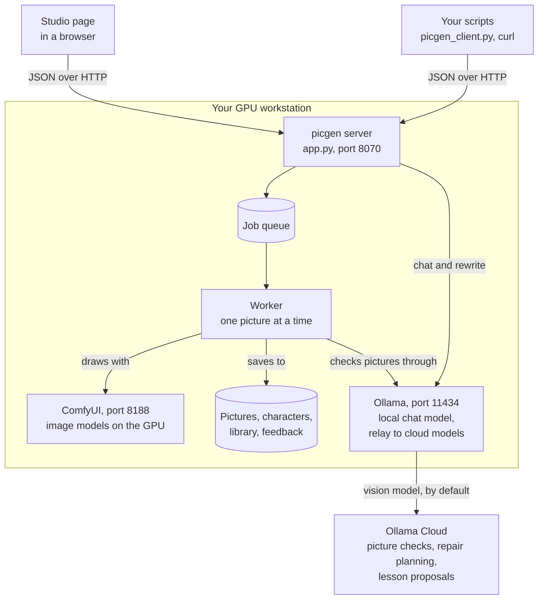

# picgen studio

A private image studio that runs on your own GPU. Describe a picture and get it in seconds. Keep a cast of recurring characters, and pose, dress and edit them across as many pictures as you like. Pictures are never drawn by a cloud service, and nobody charges per credit.

## What it does

picgen puts one web page and one HTTP API in front of the open image models running on a local graphics card. It handles the parts that make local models hard to use day to day:

- **It manages the GPU.** It starts the image engine when the first job arrives, makes room by unloading idle chat models, and shuts the engine down after a few quiet minutes so other software gets the memory back.
- **It keeps characters consistent.** Save a character once, from an upload or from a picture you made. After that, picgen picks the right reference pictures for every new scene, so the face, outfit and proportions hold.
- **It does the reference work for you.** Write one sentence, such as "runs away scared in a hoodie". The planner finds a running pose, a scared face and a hoodie in the shared library, then tells you what it picked before any GPU time is spent.
- **It learns from your feedback.** Mark a picture as wrong, say what's wrong, and picgen diagnoses it, offers a one-click repair, and turns repeated fixes into rules that improve future pictures.
- **It sends only the reviewing to the cloud.** The image models fill the graphics card, so the large vision model that checks finished pictures runs on a cloud service by default. Drawing never leaves the machine, and the review can be switched to a local model or turned off.

## Who it is for

- **Creators and small studios** that need the same characters to recur across comics, reaction GIFs, newsletters and social posts.
- **Teams that want pictures made on their own hardware**, because of client confidentiality or unreleased products. Drawing is always local; for a fully offline setup, the review step can run on a local model.
- **Developers** who want image generation behind a plain HTTP API they control, with no per-image bill.

## What is in version 1.0

| Capability | What you get |
|---|---|
| Text to image | Seven models with a guide to which suits what: Z-Image Turbo (fast, literal), FLUX.1-dev (photoreal), ToonYou (cartoon), plus two character modes and two edit modes (FLUX.1 Kontext, non-commercial; Qwen-Image-Edit 2511, Apache 2.0). Z-Image Turbo also accepts trained character LoRAs. |
| Characters | Save a character from an upload or from any gallery picture. picgen can render a 13-view sheet (expressions, profile, back view, sitting and more) and accepts uploaded expression strips, which it splits into separate views. |
| Reference planner | **Auto** chooses the identity reference, a pose or activity, a facial expression and up to two garments for each prompt. You can override any slot by hand. |
| Shared library | 298 shipped garments and objects in eight kinds (tops, pants, shorts, underwear, socks, footwear, headwear, accessories), plus outfit, expression, pose and activity views you add. Any character can use any item. |
| Editing | Change an existing picture ("make it night", "swap the jacket for a raincoat") while keeping everything else. |
| Prompt helper | A chat panel with a local language model that turns rough ideas into prompts the image models follow well, plus a one-click "Rewrite for the generator". |
| Quality loop | Thumbs up or down with issue tags, an optional automatic vision check, a diagnosis, a one-click repair and learned lessons. |
| Queue and gallery | A persistent job queue that survives restarts, live status, cancel, a gallery, a lightbox and delete. |
| HTTP API | Every action in the studio is a documented JSON endpoint, with an OpenAPI 3.1 spec, an interactive explorer at `/api/docs` and a Python client. Magic erase (`POST /api/erase`) also has a GIMP 3 plug-in. |

### Not in version 1.0

The [roadmap](08-limits-roadmap.md) says what comes next.

- User accounts, logins and per-user galleries. v1.0 trusts its network: put it on a private network or behind an authenticating proxy.
- More than one saved character per picture on the FLUX models. The planner fills one identity slot; `qwen-image` can bring a second character in through `extra_refs` when the prompt names each one (see the [API guide](04-api.md)).
- Training character LoRAs inside the studio. Drawing with a LoRA you trained elsewhere is supported on Z-Image Turbo; [Operations](07-operations.md#character-loras) has the recipe.
- Video and animation.
- Spreading work across more than one GPU.

## What you receive

| Item | Where |
|---|---|
| The application: server, quality loop, studio page | `app.py`, `feedback.py`, `static/index.html` |
| The garment library | 298 character-free items (tops, bottoms, socks, footwear, headwear, accessories as front/side/back composites), fetched into `library/` by `tools/install_library.sh`; expressions and poses are made per character in the studio. The index is `library/index.json`. |
| Library ingest tools | `tools/ingest_*.py` |
| API client (command line + Python module) | `tools/picgen_client.py` |
| API contract | `docs/openapi.json`, served live at `/api/openapi.json` |
| This documentation, as Markdown and as one HTML page | `docs/*.md`, `docs/dist/picgen-docs.html`, served at `/docs` |
| Service unit and deployment notes | [Operations](07-operations.md) |

## How it fits together

## Models at a glance

Speeds were measured on an RTX 3090 (24 GB) with the model already loaded. The first picture after an idle period adds about 40 seconds while the model loads.

| Model | Best for | Typical time | License |
|---|---|---|---|
| Z-Image Turbo (default) | Following the prompt literally, busy scenes, text in the picture, fast iteration | about 10 s | Apache 2.0, commercial use allowed |
| FLUX.1-dev | Photoreal people, product shots, painterly and editorial looks | about 35 s | Non-commercial |
| ToonYou (SD 1.5) | Cartoon and anime characters, stickers, fast drafts (768 px max) | about 4 s | CreativeML OpenRAIL-M |
| Qwen-Image-Edit 2511, character | Putting a saved character into a new scene when the result must be commercially usable; up to three references (identity, guides, a second character) | about 50 s, extra references free | Apache 2.0, commercial use allowed |
| Qwen-Image-Edit 2511, edit | Changing an existing picture, or bringing a second character into it, for commercial work | about 50 s | Apache 2.0, commercial use allowed |
| FLUX.1 Kontext, character | Putting a saved character into a new scene | about 90 s, plus 55 s for each extra reference | Non-commercial |
| FLUX.1 Kontext, edit | Changing an existing picture and keeping the rest | about 90 s | Non-commercial |

> **Licensing.** Two model families do character and edit work. Qwen-Image-Edit 2511 (Apache 2.0) is cleared for commercial use and is the one to pick for anything that will be sold or published. FLUX.1 Kontext [dev] and FLUX.1-dev (the photoreal model) are released by Black Forest Labs under a non-commercial license; selling or publishing their pictures needs a commercial license from Black Forest Labs. picgen shows each model's license in the studio so users can see this.

## A ten-minute tour

1. **Fast picture.** On the Create tab, leave the model on Z-Image Turbo and enter *"A red fox asleep in fresh snow at dawn, soft pink light."* It is ready in about 10 seconds, or 50 if the model was asleep.
2. **Character in a scene.** Pick a saved character. Type *"gets scared and runs away"* and watch the line under the prompt: **Auto will use →** shows a running pose and a scared face. Queue it now; it takes two to three minutes.
3. **Edit.** Open any picture, choose **Edit**, and enter *"make it night, keep everything else the same."*
4. **Feedback.** Give a picture a thumbs-down, tick what is wrong, and run the suggested repair.
5. **API.** In a terminal: `tools/picgen_client.py generate "a lighthouse at dusk" --wait --out lighthouse.png`.

## Where to read next

| You are... | Read |
|---|---|
| Wondering why it works the way it does | [Philosophy](02-philosophy.md), then [Limits and roadmap](08-limits-roadmap.md) |
| Using the studio | [User guide](03-user-guide.md) |
| Calling it from code | [API guide and reference](04-api.md) |
| Changing the server | [Backend architecture](05-backend.md) |
| Changing the studio page | [Frontend architecture](06-frontend.md) |
| Installing or running it | [Operations](07-operations.md) |
