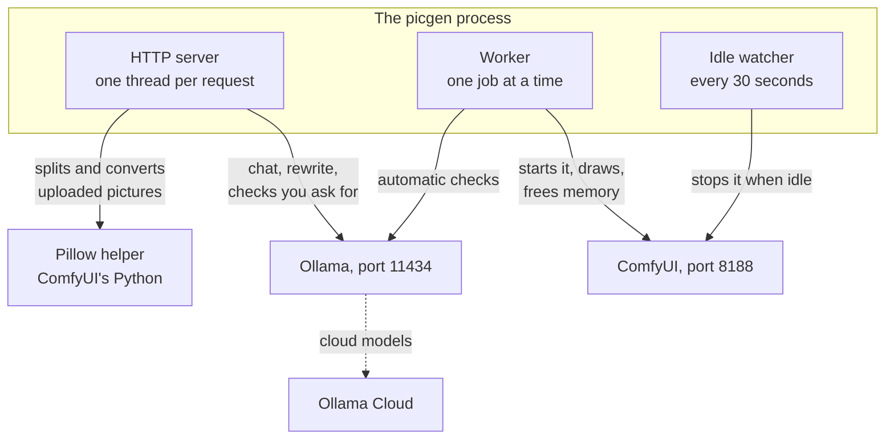
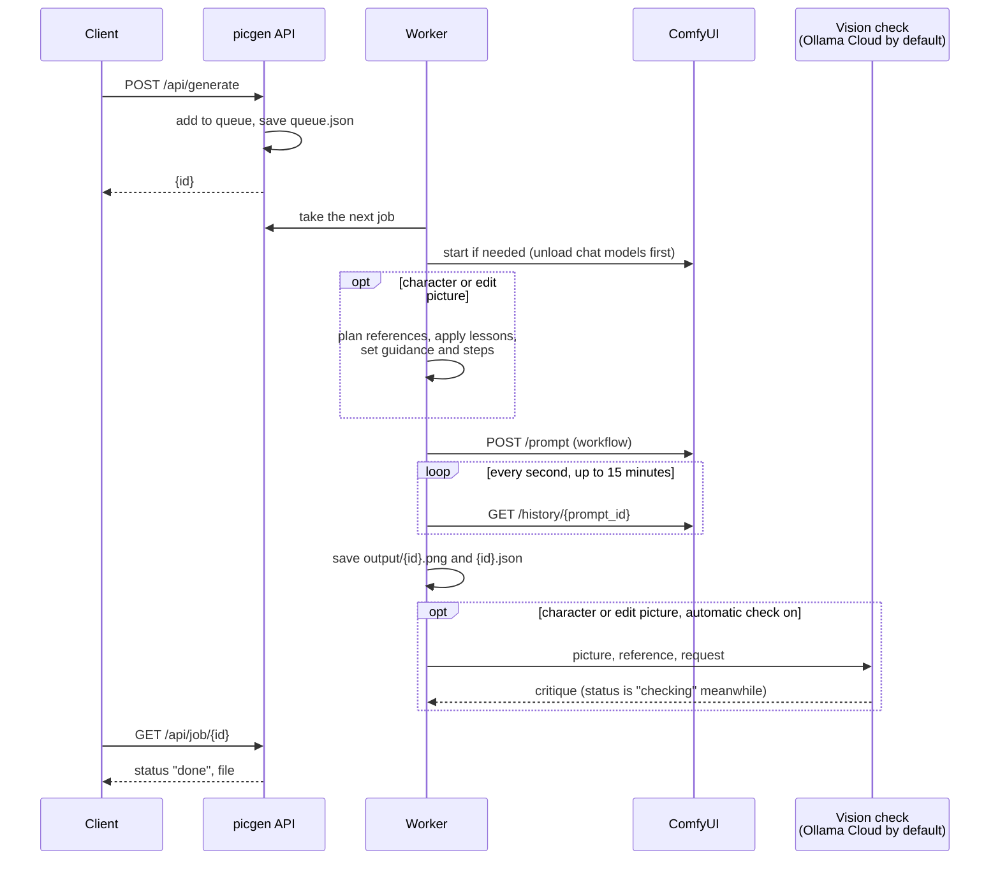
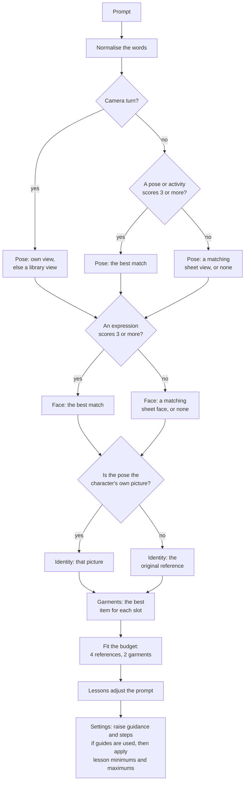
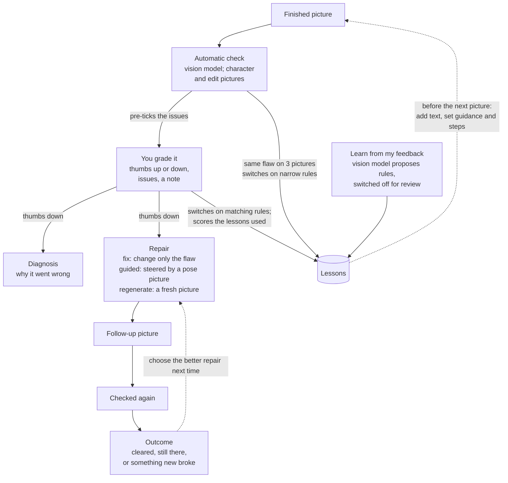

# Backend architecture

The server is two Python files that use only the standard library: `app.py` (HTTP, queue, GPU, characters, library, planner) and `feedback.py` (grading, automatic check, diagnosis, repairs, lessons). They drive ComfyUI for images and Ollama for language and vision models.

## Process model



- **One HTTP server** (`ThreadingHTTPServer`, class `H`) answers every request. Each request runs in its own thread, and every handler is wrapped by `_guard`, so a crash returns `500 {"error": ...}` instead of a dropped connection.
- **One worker thread** pops jobs off the queue and runs them one at a time. The GPU can only do one thing at once, and serialising here keeps memory predictable.
- **One idle watcher** stops ComfyUI when nothing has run for `IDLE_MINUTES`.
- **Pillow is not imported.** Image splitting, compositing and format conversion run as short Python subprocesses in ComfyUI's own virtual environment, which already has Pillow. That keeps picgen itself dependency-free.

Startup order: `fb.init()` (database and built-in lessons), then `load_queue()`, the worker, the idle watcher, and finally `serve_forever()`. On exit, ComfyUI is stopped.

## Source map

| File | What lives there |
|---|---|
| `app.py` | Configuration, model registry and ComfyUI workflow builders, image splitting, characters and views, library, garment matching, the reference planner, edit planning, queue and worker, GPU orchestration, chat and prompt compile, the HTTP handler |
| `feedback.py` | Issue taxonomy, the vision critic, diagnosis, repair builder, fix-route choice, lessons (apply, settle, strengthen, learn), statistics; SQLite storage |
| `static/index.html` | The studio page (see [Frontend](06-frontend.md)) |
| `static/api-docs.html` | The API explorer served at `/api/docs` |
| `tools/` | Library ingest tools, the API client, the OpenAPI source and the docs builder |

In `app.py`, search for the `# ----` banners to find a section.

## From request to picture



### Job lifecycle

| Status | Meaning |
|---|---|
| `queued` | Waiting in `data/queue.json` |
| `starting model` | Set at the start of every run; slow only when ComfyUI is cold (about 40 s) |
| `drawing` | Workflow submitted, polling ComfyUI |
| `drawing a pose guide` | A guided repair is first drawing its pose picture with Z-Image |
| `checking` | Picture saved; the vision critic is reviewing it |
| `done` | Finished; `file` and `seconds` are set |
| `failed` | `error` holds the reason (ComfyUI rejected the workflow, ComfyUI produced no image, timeout after 900 s, a missing model…) |

Jobs come from four places, all with the same shape: `POST /api/generate`, character sheets (`queue_sheet`), own versions (`queue_derive`) and repairs. Sheet and derive jobs carry `sheet_for` and `sheet_tag`; their output goes to `characters/<id>/<tag>.png` instead of the gallery, and they skip lessons and the critic.

The finished record, `output/<id>.json`, holds a fixed list of 31 fields (`JOB_KEYS`): the request, the references and guides actually used, garments, lessons, the exact prompt sent, effective guidance and steps, seed, time, and for fixes the critique and outcome. That record is what `GET /api/gallery` and `GET /api/job/{id}` return.

### Queue persistence

`save_queue()` writes the running job (marked `queued`) plus everything waiting to `data/queue.json` on every change, using an atomic rename. On start, `load_queue()` puts them all back. So a restart never loses waiting work, and an interrupted job runs again from the beginning. Failed jobs are kept only in memory (the last 50, in `state["recent"]`), so `GET /api/job/{id}` can report the error until the next restart.

## Models and workflows

The registry `MODELS` lists each model's label, mode, workflow builder, default steps and guidance, required files, and user-facing guide text (speed, license, best for, avoid, tips, install). A model counts as installed when it has a builder and all its files exist under `COMFY_DIR/models`.

| Model id | Mode | Workflow | Notes |
|---|---|---|---|
| `z-image-turbo` | txt2img | `wf_zimage`: UNet + Qwen3 4B text encoder, AuraFlow sampling shift 3, 8 steps, cfg 1; optional `loras` chained as `LoraLoaderModelOnly` before the shift (`lora_ok` flag) | Default. Ignores guidance. The request's `loras` are validated against `models/loras` and clamped to strength 0–2 |
| `flux1-dev` | txt2img | `wf_flux`: fp8 checkpoint, FluxGuidance | 24 steps, guidance 3.5 |
| `toonyou` | txt2img | `wf_sd15`: SD 1.5 checkpoint, dpmpp_2m karras, fixed negative prompt | Always renders 768 × 768 |
| `flux-kontext` | character | `wf_kontext` (one reference) or `wf_kontext_guide` (2–4 references, each its own chained ReferenceLatent) | The reference is always the original or an own view, never the previous output, so likeness cannot drift |
| `flux-kontext-edit` | edit | `wf_kontext_edit`: the source picture plus up to 2 pose/face references | Output size follows the source |
| `qwen-image` | character | `wf_qwen_edit`: GGUF Q6_K UNet (ComfyUI-GGUF node) + Qwen2.5-VL 7B text encoder + Lightning 8-step LoRA, AuraFlow shift 3; up to 3 references passed straight to `TextEncodeQwenImageEditPlus` (image1 = identity) | Apache 2.0. `fixed_settings`: `run_job` forces 8 steps / cfg 1 whatever the request or the studio's fields say (the guide boost and `fb.settle` are skipped too); the first studio job at the Kontext defaults ran 28 steps and took 6 minutes before this was added. `guide_builder` is the same workflow, so guides need no separate graph. A 4th reference from the planner is dropped (`max_refs: 3`) |
| `qwen-image-edit` | edit | `wf_qwen_edit`: source picture as image1, pose/face guides and `extra_refs` after it | Output is drawn from an empty latent at the requested size, not the source size |
| `chroma`, `flux2-klein-9b` | txt2img | none yet | Listed with install notes; always shown as not installed |

**Which model draws sheet views and derives.** `character_model()` / `edit_model()` return the Qwen pair whenever its files are installed and fall back to FLUX Kontext otherwise (2026-10-05). So on a machine with Qwen-Image-Edit 2511, a character's 13 sheet views and its library derives are commercially usable too; `fixed_settings` keeps them at 8 steps.

**Extra references (`extra_refs`).** Both modes accept up to two further pictures in the request (`extra_refs`: picture ids or `char:<cid>[:<view>]`). They are appended after the planner's references, so a Qwen job can show a second saved character as image 2 or 3. The prompt has to say which image is which and name each character's anchors ("the boy from image 2: red jersey with the number 8, gap-toothed grin"); a vague "keep both as drawn" lost the second character in testing (2026-10-04).

**Why references are chained, not stitched.** Placing two references side by side in one image (ImageStitch) made Kontext copy the split-screen layout, or draw one character twice and drop the other. Each reference therefore gets its own `ReferenceLatent`, and v1.0 allows one character per picture.

### Adding a model

1. Write a builder `wf_<name>(prompt, w, h, steps, seed, guidance, prefix)` that returns a ComfyUI API-format graph ending in `SaveImage(filename_prefix=prefix)`.
2. Add an entry to `MODELS` with its files, defaults and guide text. Fill in `license` honestly.
3. Put the files under `COMFY_DIR/models`. The model shows as installed on the next `GET /api/image_models`, with no restart needed for the catalog (a restart is needed for new code).

## GPU orchestration

| When | What picgen does | Why |
|---|---|---|
| A job starts and ComfyUI is down | Unload every model Ollama has resident (`ollama stop`), then start ComfyUI headless with `--reserve-vram RESERVE_VRAM`, and wait up to 120 s for it | Image models need about 12 GB; a chat model plus another tenant would not fit |
| The queue empties | `POST /free` to ComfyUI (unload models, keep the process) | Hands the memory back between bursts |
| Nothing ran for `IDLE_MINUTES` | Stop ComfyUI | Frees the GPU entirely |
| A chat request arrives and no job is waiting | Stop an idle ComfyUI, and reload a chat model that Ollama had pushed partly onto the CPU | Chat answers in seconds instead of minutes |
| ComfyUI fails to come up | Kill the half-started process and fail the job with "see comfy.log" | Never leave something holding the port |

ComfyUI output is appended to `comfy.log` beside `app.py`.

## Characters

```
characters/<cid>.png            the original reference
characters/<cid>.json           {id, name, notes, species, at, from_image?}
characters/<cid>/<tag>.png      views: generated sheet, uploaded, derived
characters/<cid>/views.json     {tag: {label, keywords, source, kind}} for uploaded, derived and taught views
```

- **Sheet.** Thirteen fixed views (`SHEET`). Face changes (sad, surprised, angry, and neutral, which is made from sad) are *edits* of the reference, because a reference-only render keeps the reference's mouth. Smiles, full body and camera turns are free *character* renders. Each row carries its own guidance and steps, tuned by testing.
- **Uploaded views.** `add_views` splits strips or grids of panels (`split_strip`, which finds dark separator lines, trims borders and caption bands, pads each panel to a square and upscales it to 768 px) and stores one view per panel with keywords taken from its label.
- **Derived views.** `queue_derive` draws the character in a library item's pose, expression or garment, about 140 s each. The result becomes an own view (`source: derived`), and own views beat borrowed guides in the planner.
- **Taught views.** An approved picture can be saved as an own view (`source: taught`) with `POST /api/feedback/teach`. picgen suggests this when a fix, or a picture drawn from another person's pose, passes the automatic check. The planner then uses that picture as identity and pose for matching requests.
- **Species** (`woman`, `dachshund`, …) goes into every prompt picgen writes for the character.

## Shared library

```
library/<tag>.png       one picture per item (garments are often a front | side | back composite)
library/index.json      {tag: {kind, label, keywords, source, file, views}}
```

- **Kinds** (`LIB_KINDS`): expression, pose, activity, outfit, top, pants, shorts, underwear, socks, footwear, headwear, accessory, prop. The last ten are *garment kinds*: worn or held extras, never the identity.
- **Source.** An item drawn with character X is X's own picture when X is drawn, and a *guide* for everyone else.
- **Keywords.** Several words make a phrase; a leading `!` marks a weak word that can rank a garment but never select it alone ("watches the waves" must not add a wristwatch).
- **Ingest.** `add_library` splits sheets, groups panels into composites (`group=3` for turnarounds), and writes the index under a lock. `tools/ingest_footwear.py` and `tools/ingest_headgear.py` are the batch versions used to load the shipped library.

## The reference planner

The planner turns a sentence into the set of pictures Kontext should look at. It lives in `plan_refs()` and is shared by the worker and `GET /api/plan`, so the preview always matches what is drawn.



Rules worth knowing:

- **Picked by hand:** a reference or garment you choose fills its slot; Auto fills only the slots you leave alone. Choosing **Original** turns pose and face matching off.
- **Camera turns** are over the shoulder, from behind, and profile. The character's own view is used if it has one, else a matching library view.
- **Sheet fallbacks:** without a scored match, a generated sheet view that fits the words is used (sitting, standing, three-quarter, walking; for faces smile, laugh, surprised, angry, sad).
- **Identity** is the character's own full-body pose view when the pose came from one, otherwise the original reference. A face-only crop is never the identity, because the model then invents the rest of the head and body.
- **Scoring** (`_view_score`): a matching phrase scores 3, a matching word 2 (1 if three letters or fewer), plus coverage, label and head-word bonuses. Generic words (pose, face, camera, sitting, standing, wearing…) never score on their own, and an item needs 3 points to be picked.
- **Normalisation:** scene words that look like poses or faces are dropped first ("the waves", "shock absorbers", "wide-angle"), then synonyms are added ("sprints" counts as running, "terrified" as scared, "beaming" as smiling). Garment matching reads the prompt as written and ignores idioms of its own ("shades of", "on her heels", "bottle cap").
- **Garments** get one slot each (shorts and trousers share a slot; accessories get one slot per category, so a watch and sunglasses can both be worn). Garments only fill reference slots left after identity, pose and face.
- **Settings.** If a pose or face guide is used and the caller left guidance and steps at the model defaults, they rise to 4.0 / 28 (3.5 / 24 with a single reference; 4.5 / 28 for edits). Values the caller set are left alone, except where a lesson sets a floor or ceiling.
- **Prompt wording.** `guide_prompt()` tells the model what each reference is ("the second image is an action guide of a different person…", "wearing exactly that footwear…") and ends with "Make ONE single picture of the first character only."
- **Edits** use `plan_edit()`. It looks only for pose and face matches, chains them as extra references, and adds "Keep everything else exactly the same."

## Feedback and lessons

`feedback.py` closes the loop; the [Philosophy](02-philosophy.md) explains why it exists.



- **Issues:** anatomy, gaze, pose, expression, garment, identity, scene, style, artifact, other.
- **Critic.** It runs inside the worker after character and edit pictures, so the job shows `checking`. It reports hands, arms, gaze, head, clothing, whether the picture matches the request, and a list of issues with severities. It judges a fix against the *original* request, not the fix instruction.
- **Repairs.** Gaze and pose flaws can take the *guided* route, steered by a pose picture. The vision model works out the action the character should show from the request and your note, and picgen picks a library pose for that action. It never reuses the view that caused the flaw, and when nothing fits it draws a new pose picture with Z-Image and adds it to the library. The choice between routes uses each route's measured clearance rate with a prior. Identity and style flaws recommend a fresh picture, because an edit keeps the face and look. A repair names what must be kept: the character's permanent features (read once from its reference and cached), and the picture's clothing, held objects and setting.
- **Lessons** are rows with a trigger (`always`, `character`, `keywords`, or a built-in condition such as "the prompt names a gaze") and an action (`prepend`, `append`, `guidance_min`, `guidance_max`, `steps_min`, or a structural change such as "use the original reference"). Thirteen built-ins ship, three of them switched on: `character-framing` (says the picture shows the character from the reference), `guide-subject-check` (drops a keyword-picked pose or face whose matching words describe someone else in the prompt, so "a dog playing" no longer borrows the character's guitar-playing view) and `foreign-guide-identity` (names the character's permanent features whenever a pose or face comes from another character). A thumbs-down switches on the built-ins of the flagged category that fit the request. Style is the one split by request: when the prompt asks for another art style ("in the style of", "anime", "photorealistic", "Ghost in the Shell"…), a style flaw switches on `restyle-explicit`, which tells the model to leave the reference's line art behind; on an ordinary request it switches on `style-lock`, which keeps the reference's style. The automatic check can switch on five narrow built-ins after three distinct flagged pictures, but never one you switched off yourself. Lessons proposed by the learner arrive switched off. Floors apply after ceilings, so a needed minimum always wins.
- **Storage:** `data/feedback.db` (SQLite, WAL) with tables `feedback`, `lessons`, `critiques`, `outcomes` and a cache of character descriptions.

## Storage layout

```
picgen/
  app.py  feedback.py
  static/index.html  static/api-docs.html
  output/<id>.png  output/<id>.json         gallery pictures and their records
  characters/…                              see Characters
  library/<tag>.png  library/index.json
  data/queue.json                           waiting jobs
  data/feedback.db                          grades, critiques, outcomes, lessons
  comfy.log                                 image engine log (grows; rotate it)
  docs/                                     this documentation, openapi.json, built HTML
  tools/                                    client, ingest tools, spec, docs builder
COMFY_DIR/input/picgen-*.png                copies of references for ComfyUI (refreshed by mtime)
COMFY_DIR/output/picgen-<id>_*.png          ComfyUI's own copy of each picture (removed by DELETE /api/image)
```

Everything is plain files. A backup is a copy of the `picgen` folder; see [Operations](07-operations.md#backup-and-restore).

## Concurrency and safety

- **Shared JSON files** (`library/index.json`, each `views.json`, `queue.json`) are updated under an exclusive `fcntl` lock with re-read-modify-write, and saved by writing a temporary file and renaming it. Slow work such as splitting happens before taking the lock. Several ingest scripts and the server can safely write the library at the same time.
- **The worker** takes the next job and marks it current under one lock, so status readers never miss a job between the two steps.
- **Identifiers from clients** pass through `Path(x).name` (no directories). Destructive routes also check a strict pattern: character ids `c\d+` and an existing record, picture ids `\d+-\d+`. This exists because `Path("..").name` is `..`, and a character delete must never reach the project root.
- **Limits:** prompt 2,000 characters; uploads 40, 120 and 200 MB; steps 1–60; guidance 0–15; garments and references as configured.

## Extending

| Change | Where |
|---|---|
| New endpoint | Add the route in class `H` (`_do_GET`, `_do_POST`, `_do_DELETE` or `_do_PATCH`), return JSON through `self._json`, then describe it in `tools/openapi_spec.py` and rebuild the docs |
| New library kind | `LIB_KINDS` (and `GARMENT_KINDS` if worn), wording in `guide_prompt()`, and a badge colour in `static/index.html` |
| New sheet view | Add a row to `SHEET` (tag, prompt, guidance, steps, mode) and, if it is a camera turn, a rule in `_POSE_RULES` |
| New built-in lesson | `BUILTIN` in `feedback.py` |
| New issue category | `ISSUES` in `feedback.py`, with its repair wording |

## Maintainer notes

These are behaviours a maintainer should know about. None of them block normal use.

- ComfyUI start and stop always use `127.0.0.1:8188`. `COMFY_URL` only changes where HTTP calls go, so moving ComfyUI to another port or host needs a code change.
- `comfy_stop` stops whatever process is listening on port 8188, including a ComfyUI started outside picgen.
- The saved `w` and `h` are the requested size. ToonYou always draws 768 × 768, and edits keep the source picture's size.
- Job ids are seconds plus four random digits. A large burst of sheet or derive jobs queued in the same second could, rarely, produce two jobs with the same id.
- Unused code kept for reference: `match_view`, `match_sheet`, `match_library`, `_kw_score`, the two-reference stitch branch, and the inline fallback page (`PAGE`), which is used only if `static/index.html` is missing.
