# What picgen can do: the DV-7 demo set

Every picture on this page was made on one RTX 3090 with the models and workflow described in the main documentation. The character, **David DV-7**, is fictional. Nothing here is a likeness of a real person.

## The studio

| Creating a character | Using a character |
|---|---|
| 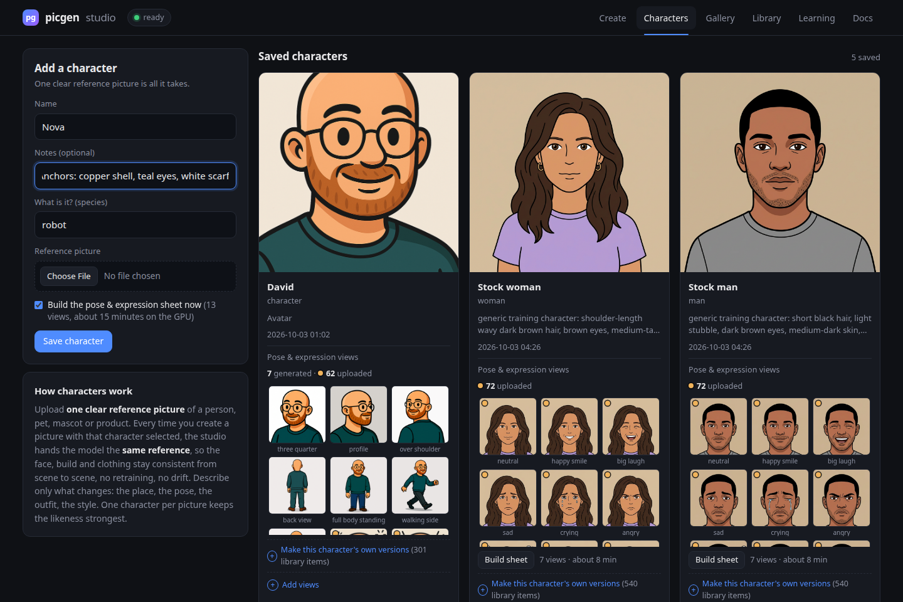 | 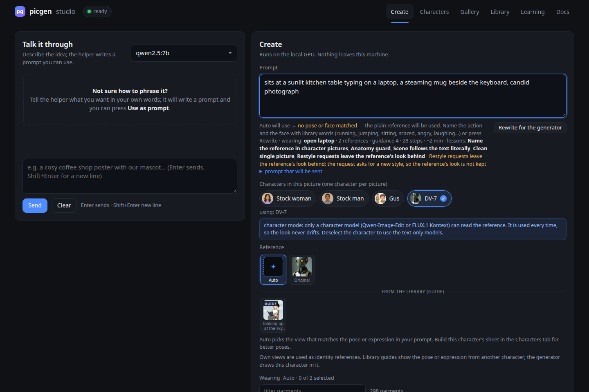 |
| *Characters → Add a character: a name, what it is, a reference picture, and the 13-view sheet option.* | *Create: pick a character chip, describe one moment, and the line under the prompt shows what the planner will use before any GPU time is spent.* |

## 1. Inventing the character

Two text-to-image portraits with **FLUX.1-dev** (fp8 checkpoint, 28 steps, guidance 3.5, seeds 501 and 502). The prompt named every anchor the planner would later need to keep: pale grey-blue head shell with a centre seam, two round warm-amber lens eyes, chrome speaker-slit mouth, round side ear-ports, ribbed black neck, chipped white chest plate with a blue **DV-7** label, olive canvas work jacket.

| | |
|---|---|
| 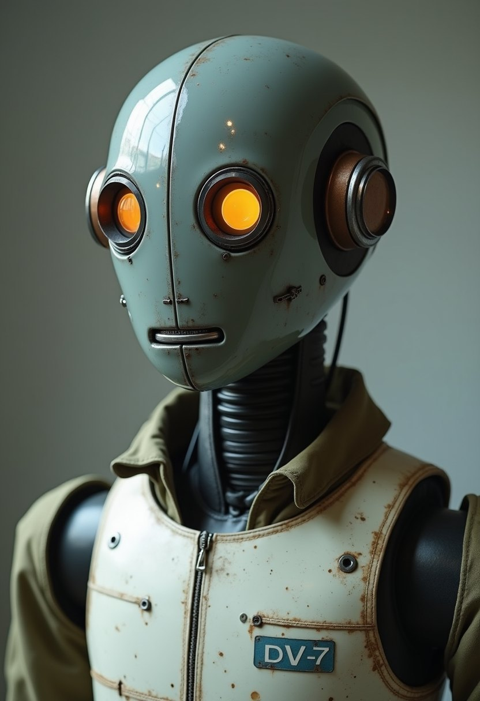 | 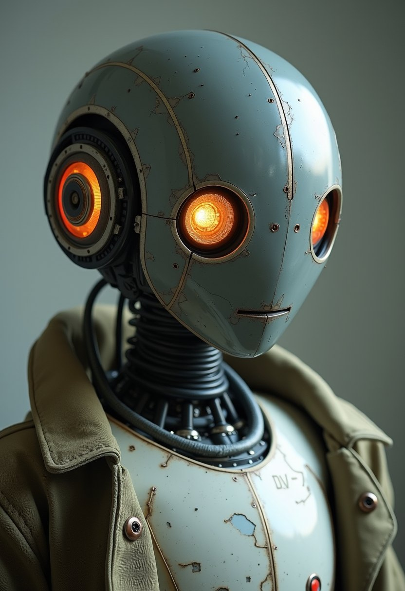 |
| Seed 502. Front-facing, so it became the character's reference with **Save as character**. | Seed 501. Kept as a second portrait. |

## 2. The same character in new scenes

Four pictures with **Qwen-Image-Edit 2511** in character mode (`qwen-image`, Apache 2.0, 8 steps, cfg 1 fixed by the Lightning LoRA). Each request carried the character id and `"reference": "original"`, so the saved portrait was the only reference, and `"guides": false`, because this model treats every reference picture as a figure to put in the scene. Median time was 53 to 76 seconds a picture.

| | |
|---|---|
| 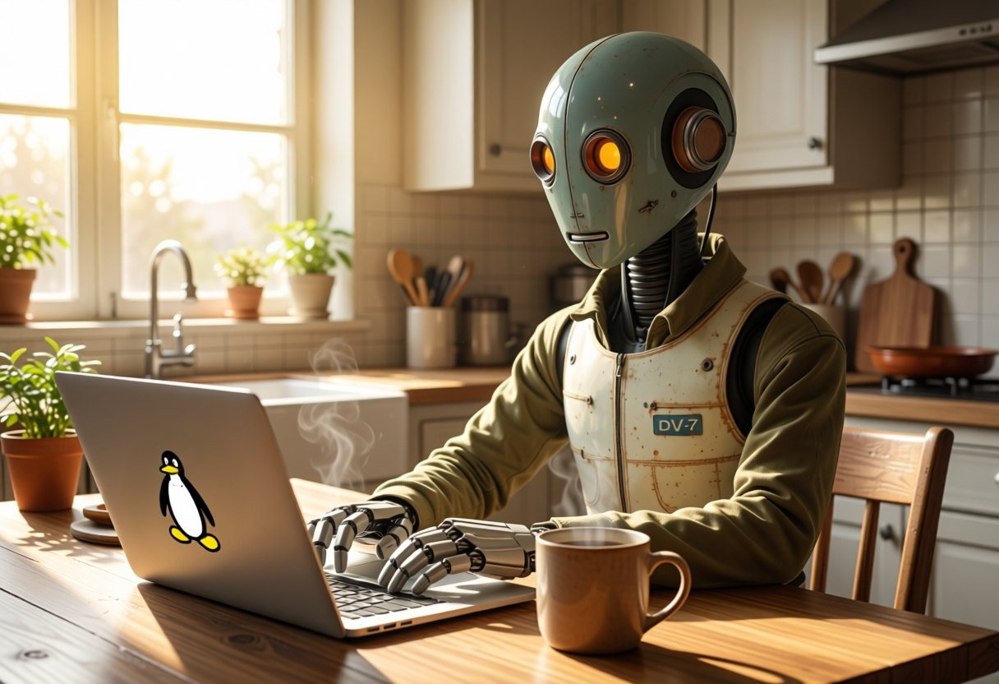 | 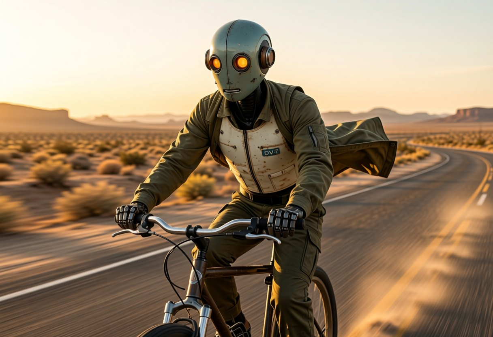 |
| 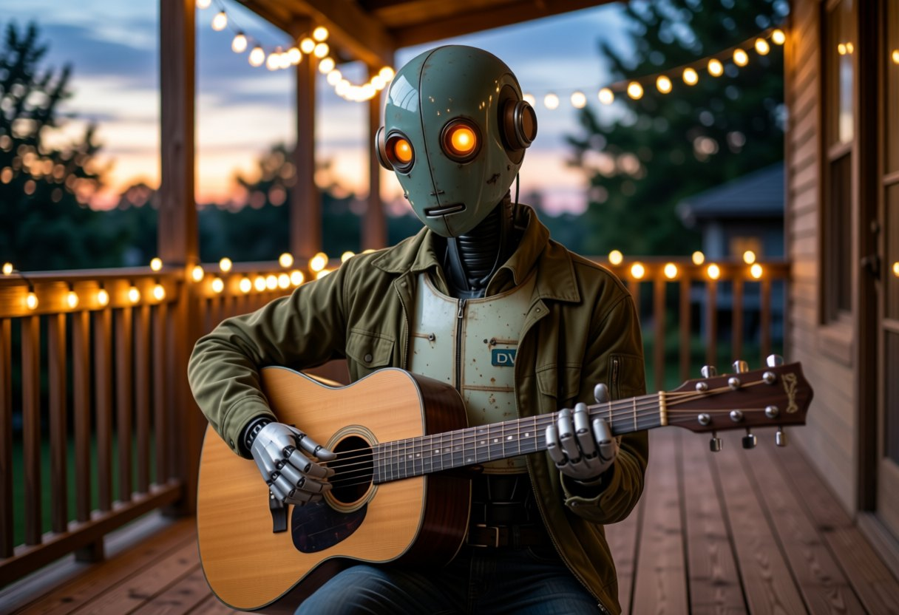 | 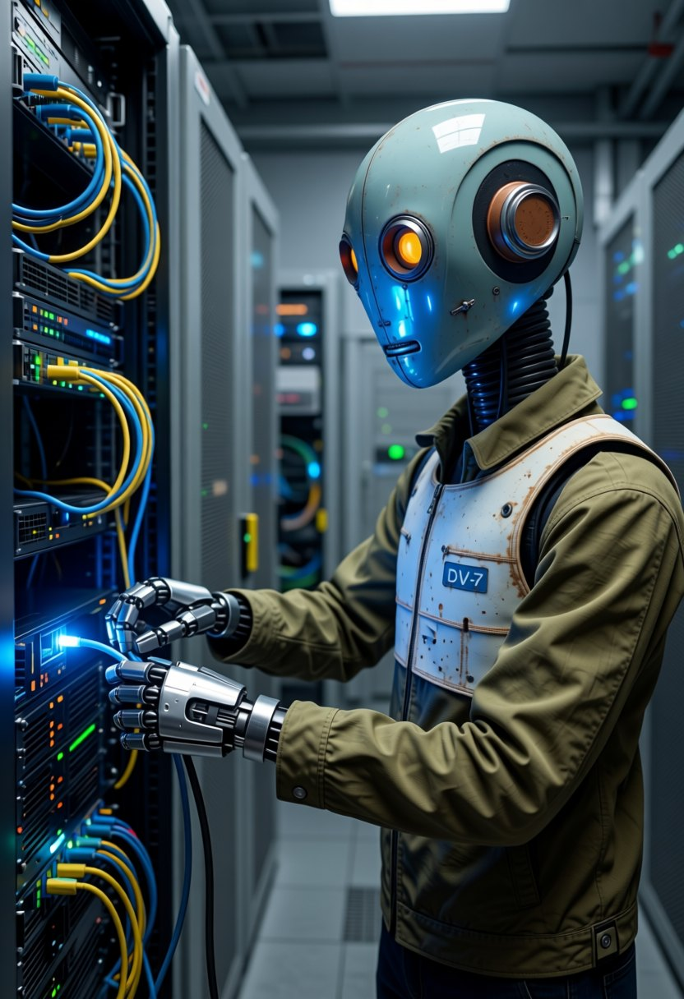 |

What went wrong and how the feedback loop handled it: the reference shows no hands, and in three of eight scenes with empty hands the model drew human hands. Each got a thumbs-down with the *anatomy* issue, which picgen recorded as feedback rows 16 to 19, and a hands-only pass with `qwen-image-edit` ("replace the human hands with segmented gunmetal robotic hands, keep everything else the same") cleared every one in a single try. The fixes were graded up (rows 20 and 21), so the loop now knows that route works for this flaw.

## 3. Restyling as Dragon Ball Z animation

The same six pictures sent through **Qwen-Image-Edit 2511** in edit mode (`qwen-image-edit`), each with its photo as `edit_of` and one prompt: *"Change the art style completely: redraw this exact scene as a 1990s Dragon Ball Z anime cel. Bold clean black outlines, flat cel shading with two-tone shadows, saturated colours, Akira Toriyama character design… Keep the same composition, pose, camera angle and every element of the android."* Composition and identity survive the restyle because the source picture is the model's reference.

| | |
|---|---|
| 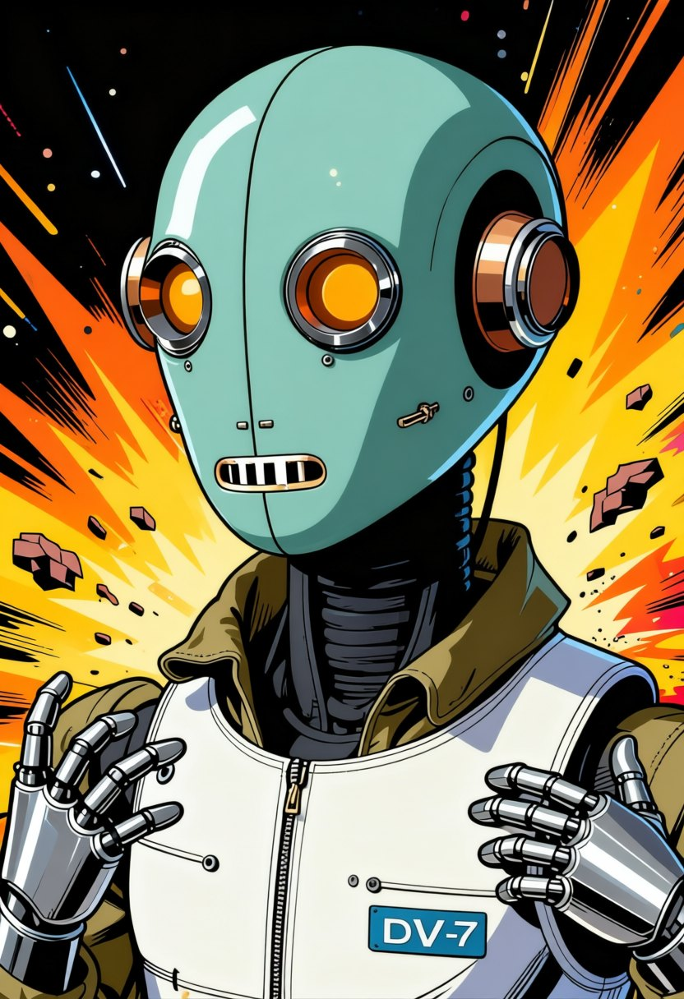 | 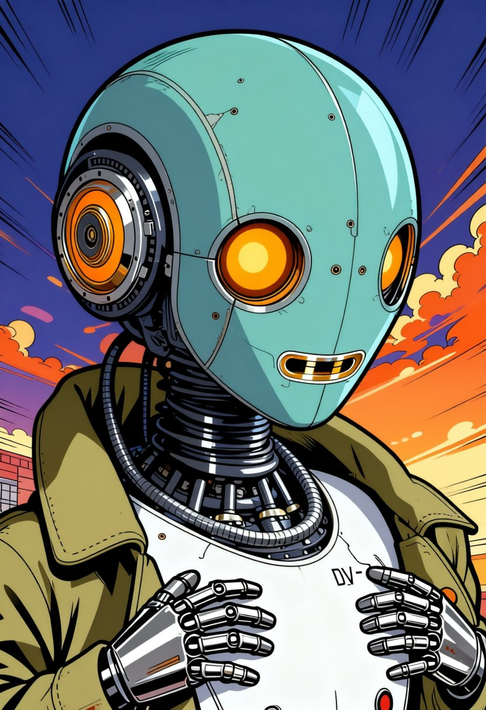 |
| 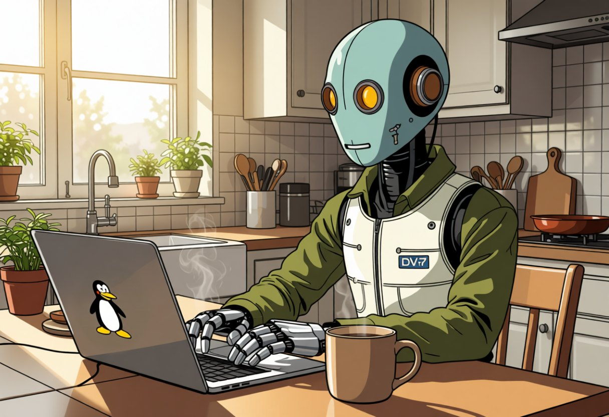 | 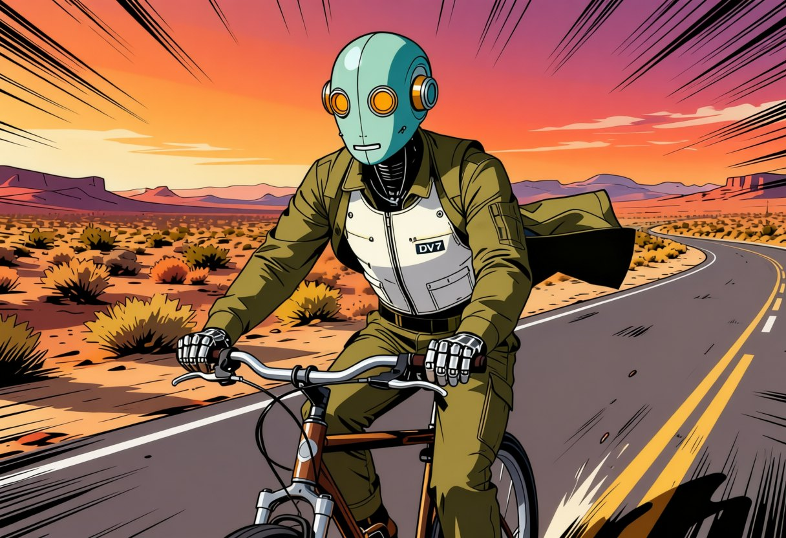 |
| 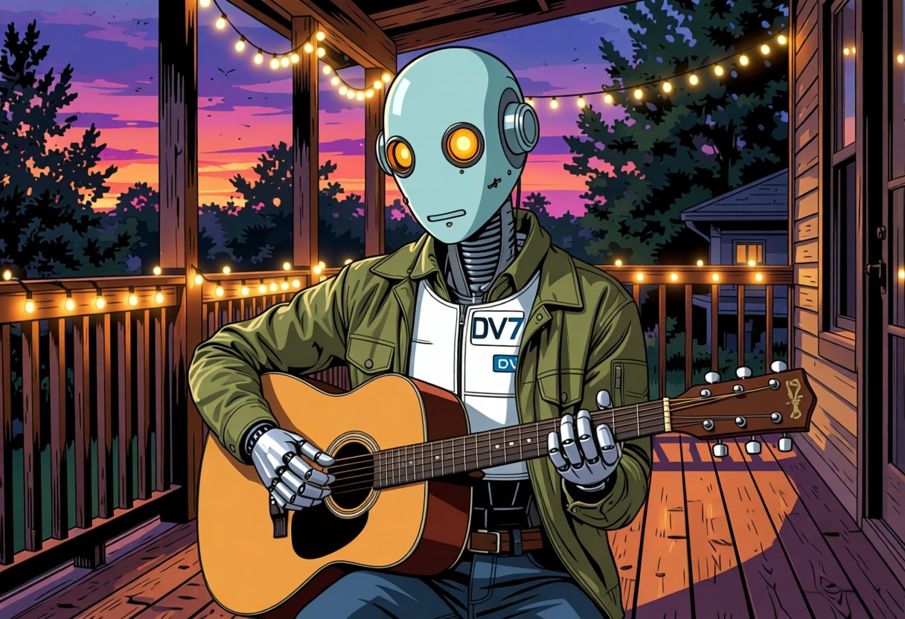 | 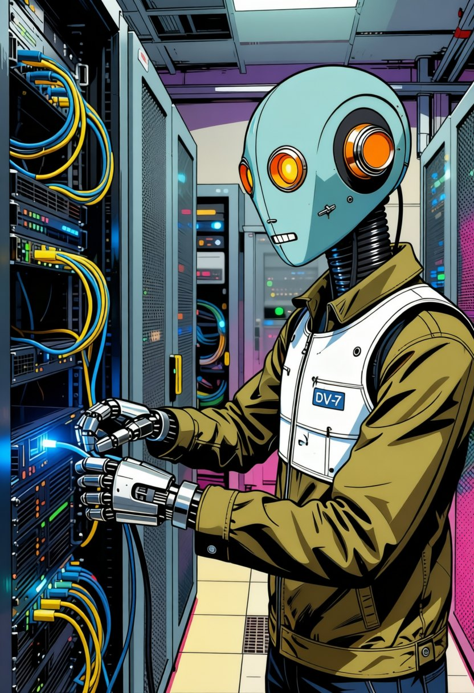 |

Honest flaws left in: the first portrait gained a pair of hands the photo did not have, and the guitar picture doubled the DV-7 label.

## 4. A one-element edit done precisely

The laptop lid in both coffee pictures originally carried an apple logo. The request was to show a Linux penguin and change nothing else. An edit-model pass does the swap but redraws the whole frame (on the photo it also removed the jacket), so the edit was used only as a source: a small soft-edged patch around the new logo was composited onto the original with Pillow, leaving every other pixel untouched. That is the same mechanism `POST /api/erase` uses for magic erase, applied by hand.

## Models and licenses used here

| Step | Model id | License | Why |
|---|---|---|---|
| Inventing the face | `flux1-dev` | Non-commercial (Black Forest Labs) | Best photoreal skin, metal and fabric for the first portrait |
| Scenes with the character | `qwen-image` | Apache 2.0 | Commercially usable, holds identity from one reference, 50 to 75 s a picture |
| Hands fixes and the anime restyle | `qwen-image-edit` | Apache 2.0 | Edits that keep composition, including full restyles |

Because the reference portrait itself came from FLUX.1-dev, this particular set is for demonstration, not sale. A fully commercial pipeline starts the portrait on `z-image-turbo` (Apache 2.0) and keeps the rest identical.

## Reproduce it

```bash
PICGEN=http://127.0.0.1:8070
# 1. a portrait
curl -s -X POST $PICGEN/api/generate -H 'Content-Type: application/json' -d '{"prompt": "Hyper-realistic cinematic photograph of a humanoid android ...", "model": "flux1-dev", "size": "portrait", "steps": 28, "guidance": 3.5, "seed": 502}'
# 2. save it as a character
curl -s -X POST $PICGEN/api/characters/from_image -H 'Content-Type: application/json' -d '{"image_id": "<id>", "name": "David DV-7", "species": "android", "build_sheet": 0}'
# 3. a scene
curl -s -X POST $PICGEN/api/generate -H 'Content-Type: application/json' -d '{"prompt": "The same android from the reference ... sits at a sunlit kitchen table typing on a laptop ...", "model": "qwen-image", "characters": ["<cid>"], "reference": "original", "guides": false, "garments": [], "size": "landscape"}'
# 4. restyle it
curl -s -X POST $PICGEN/api/generate -H 'Content-Type: application/json' -d '{"prompt": "Change the art style completely: redraw this exact scene as a 1990s Dragon Ball Z anime cel ...", "model": "qwen-image-edit", "edit_of": "<id>", "size": "landscape"}'
```

The full prompts are in each picture's record (`GET /api/job/{id}` returns `prompt` and `prompt_sent`).
